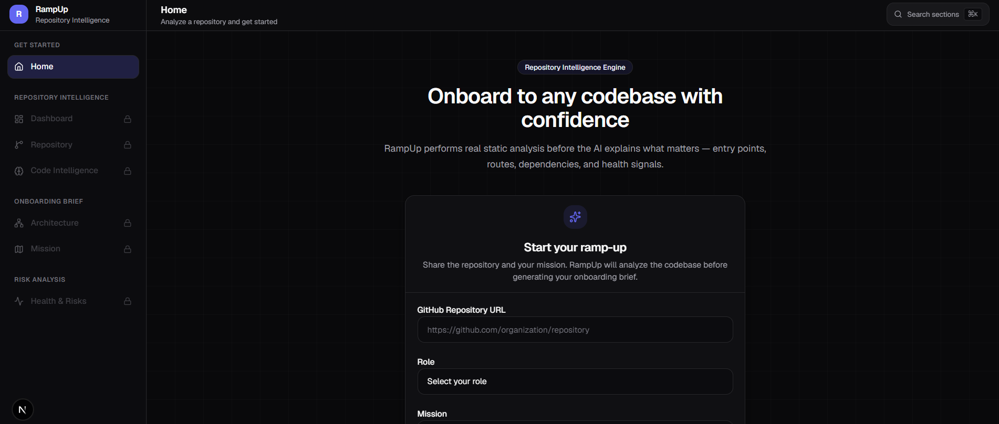
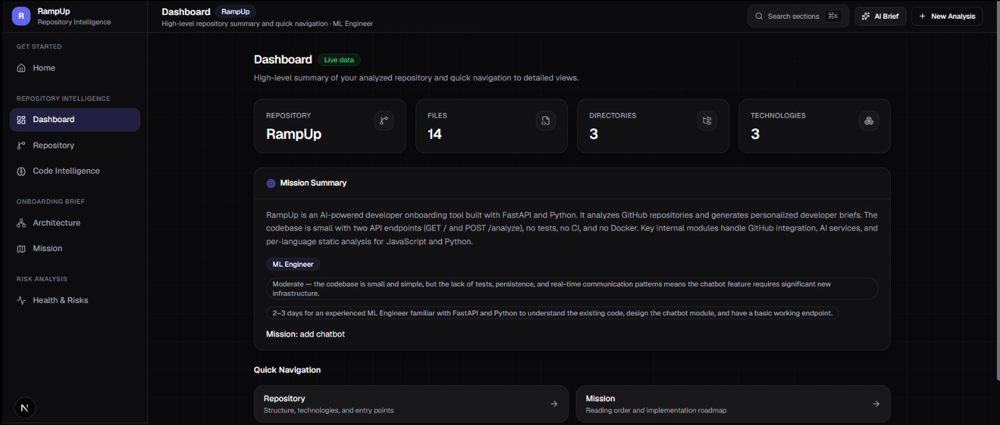

# ✨ RampUp — AI-Powered Developer Onboarding Assistant

> **Understand any GitHub repository in minutes, not days.**

RampUp is an AI-powered developer onboarding assistant that combines **static code analysis** with **Large Language Models (LLMs)** to generate repository-aware onboarding guidance.

Instead of relying solely on README files or repository descriptions, RampUp analyzes the actual source code to identify:

- 📍 Project entry points
- 🔗 Dependency relationships
- 🌐 API endpoints
- 📦 Technologies & frameworks
- 📁 Important files
- 🏗 Repository structure
- 🩺 Repository health
- 🧠 Code intelligence (classes, functions, import hubs)

It then generates a personalized onboarding roadmap based on the developer's **role** and **first engineering task**, helping new contributors become productive much faster.

---

# 🎥 Demo

**Video Demo:** *https://youtu.be/ash1U4vRU3M*

**Live Demo:** *https://ramp-up-ai.vercel.app/*

---

# 📸 Preview

### Landing Page




### Repository Intelligence Dashboard



---

# ❓ Problem

Developers joining an unfamiliar project often spend hours understanding:

- Where does the application start?
- Which files are actually important?
- Which APIs already exist?
- How is the project structured?
- Where should they begin implementing their assigned task?

Traditional AI repository summaries frequently rely on README files or repository metadata and may hallucinate project structure or provide generic advice.

---

# 💡 Solution

RampUp performs **repository intelligence before AI reasoning.**

Instead of asking an LLM to "guess" the project, RampUp first performs static analysis to extract verified information directly from the source code.

This factual intelligence is then supplied to the LLM, producing onboarding recommendations grounded in the actual repository.

---

# ✨ Key Features

## 🔍 Repository Intelligence Engine

Automatically detects:

- Technologies
- Frameworks
- Entry points
- Dependency graph
- API endpoints
- Repository health
- Important files
- Classes & functions

---

## 🧠 AI-Powered Personalized Onboarding

Developers provide:

- GitHub Repository URL
- Their Role
- Their First Task

RampUp generates:

- Repository overview
- What to understand first
- Reading order
- Implementation roadmap
- Potential risks
- Difficulty estimate
- Time to first contribution

---

## 📊 Interactive Dashboard

After analysis, developers can explore repository intelligence through dedicated sections:

- Repository Overview
- Mission Map
- Reading Order
- Execution Flow
- Dependency Explorer
- API Explorer
- Repository Health
- Code Intelligence
- Implementation Roadmap
- Risks

---

# 🏗 Architecture

```
GitHub Repository
        │
        ▼
Repository Clone
        │
        ▼
Static Analysis Engine
        │
 ┌───────────────┐
 │ Python AST    │
 │ JS Analyzer   │
 │ Health Check  │
 │ Entry Points  │
 │ Dependencies  │
 └───────────────┘
        │
        ▼
Repository Intelligence Report
        │
        ▼
LLM (Fireworks AI)
        │
        ▼
Repository-Aware Onboarding
        │
        ▼
Interactive Dashboard
```

---

# 🧩 Tech Stack

## Frontend

- Next.js
- React
- TypeScript
- Tailwind CSS
- Framer Motion

## Backend

- FastAPI
- Python

## AI

- Fireworks AI
- Prompt Engineering

## Repository Analysis

- Python AST
- Regex-based JavaScript analysis
- GitPython

---

# 📂 Project Structure

```
RampUp/
│
├── backend/
│   ├── repo_intelligence/
│   ├── ai_service.py
|   ├── github_service.py
│   ├── prompts.py
│   ├── main.py
│   └── requirements.txt
│
├── frontend/
│   ├── app/
│   ├── components/
│   ├── contexts/
│   ├── lib/
│   └── package.json
│
└── README.md
```

---

# ⚙️ Installation

## Clone the Repository

```bash
git clone https://github.com/AreebDastgeer/RampUp.git

cd RampUp
```

---

## Run with Docker (Recommended)

Create a `.env` file in the backend directory:

```env
FIREWORKS_API_KEY=YOUR_API_KEY
FIREWORKS_MODEL=YOUR_MODEL
FIREWORKS_MAX_TOKENS=1500
```

Then run:

```bash

docker compose up --build

```

Frontend:
http://localhost:3000

Backend:
http://localhost:8000


## Local Setup

# Backend Setup

Create a virtual environment:

```bash
cd backend
python -m venv .venv
```

Activate it:

### Windows

```bash
.venv\Scripts\activate
```

### macOS / Linux

```bash
source .venv/bin/activate
```

Install dependencies:

```bash
pip install -r requirements.txt
```

Create a `.env` file:

```env
FIREWORKS_API_KEY=YOUR_API_KEY
FIREWORKS_MODEL=YOUR_MODEL
```

Run the backend:

```bash
uvicorn main:app --reload
```

Backend runs on:

```
http://localhost:8000
```


# Frontend Setup

Navigate to the frontend:

```bash
cd frontend
```

Install dependencies:

```bash
npm install
```

Create `.env.local`

```env
NEXT_PUBLIC_API_URL=http://localhost:8000
```

Run:

```bash
npm run dev
```

Frontend:

```
http://localhost:3000
```

---

# 🚀 How to Use

1. Open RampUp.
2. Paste a public GitHub repository URL.
3. Select your developer role.
4. Enter your first engineering task.
5. Click **Start RampUp**.
6. Explore the generated onboarding dashboard.

---

# 📈 Example Workflow

```
GitHub URL
      │
      ▼
Repository Intelligence
      │
      ▼
AI Analysis
      │
      ▼
Repository Dashboard
      │
      ▼
Start Contributing
```

---

# 🌟 What Makes RampUp Different?

Unlike traditional repository summarizers, RampUp performs **real static code analysis before invoking the LLM**.

This enables repository-aware guidance grounded in verified codebase facts rather than assumptions.

The system automatically identifies:

- Project entry points
- Internal dependencies
- API routes
- Important source files
- Repository health
- Technologies
- Project structure

These insights are then used to generate onboarding guidance tailored to the developer's role and assigned task.

---

## ⚠️ Current Limitations

RampUp is currently an MVP focused on demonstrating AI-powered repository onboarding.

### Supported Languages

Repository analysis currently supports:

- ✅ Python
- ✅ JavaScript / TypeScript (Frontend)

The system can:
- Detect project structure
- Analyze important files
- Generate onboarding missions
- Build repository health insights
- Identify dependencies
- Produce execution flow summaries

### Current Scope

- Backend code intelligence is optimized for Python repositories.
- Frontend analysis is optimized for JavaScript/TypeScript (React, Next.js).
- Repositories written primarily in languages such as Java, C++, C#, Go, Rust, PHP, Ruby, or Swift are not yet deeply analyzed.
- Mission generation quality depends on the repository structure and documentation available.


# 🔮 Future Improvements

- Multi-language repository support
- Interactive dependency graph visualization
- Architecture diagram generation
- Pull request impact analysis
- IDE integration
- Team onboarding history
- Incremental repository analysis

---

# 👥 Team

- Team Name: 
*Noob Entity*
- Team Member/s: 
*Areeb Dastgeer*

---

# 📄 License

This project was developed for the **lablab.ai Hackathon**.
